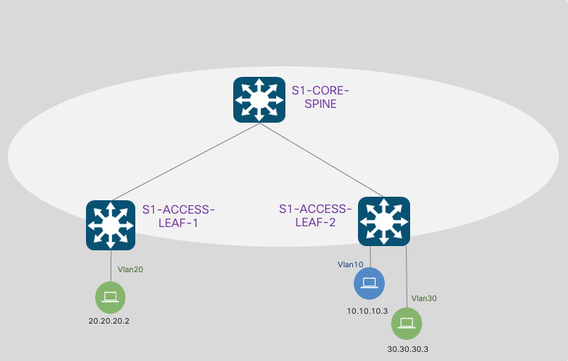
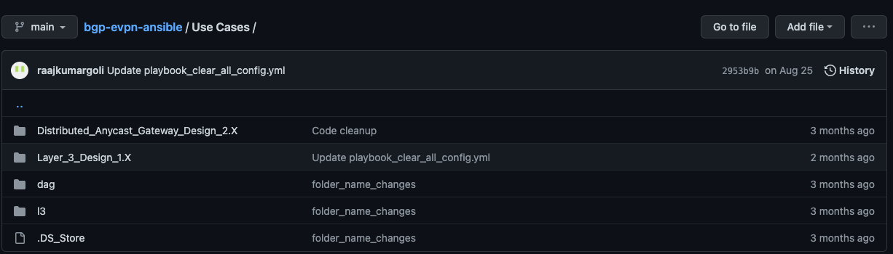
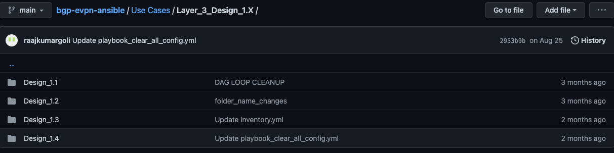
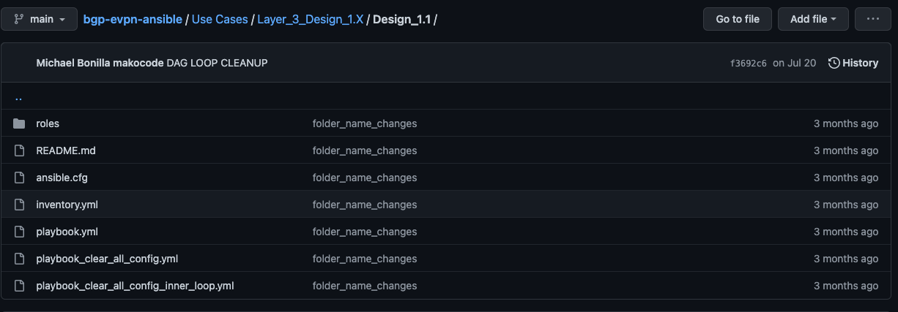

<h1 id="overview-of-catalyst-9000-platforms"> Overview of Catalyst 9000 platforms</h1>
<p>Internet of Things (IoT), mobility, and multi-cloud running on the feature-rich Cisco IOS-XE and field-reprogrammable UADP ASIC technologies which enable open programmability, analytics, and telemetry.</p>
<p>Catalyst 9000 switching platforms offer flexible overlay solutions like Software Defined Access (SDA) fabric, End-to-End MPLS Solution and BGP-EVPN fabrics.</p>
<h1 id="bgp-evpn-overview-on-catalyst-9000-switching-platforms">BGP-EVPN Overview on Catalyst 9000 switching platforms</h1>
<p> Cisco Catalyst 9000 switching systems are empowered with feature-rich Cisco IOS<sup>®</sup> XE is next-generation purpose-built Ethernet switching systems supports BGP EVPN VXLAN fabric solution to transform next-generation Enterprise campus network virtualization requirements. </p>
<p>VXLAN is designed to overcome the inherent limitations of VLANs and STP. It is a proposed IETF standard [RFC 7348] to provide the same Ethernet Layer 2 network services as VLANs do, but with greater flexibility. Functionally, it is a MAC-in- UDP encapsulation protocol that runs as a virtual overlay on an existing Layer 3 network.</p>
<p>A VXLAN overlay, requires:</p>
<ul>
<li><p>An underlying transport network that performs data plane forwarding, for unicast communication between end points connected to the fabric.</p></li>
<li><p>A control plane that can distribute Layer 2 and Layer 3 host reachability information across the network.</p></li>
</ul>
<h1 id="bgp-evpn-solution-based-ansible-playbooks">BGP EVPN: Solution based Ansible Playbooks</h1>
<p>There are different overlay topologies that can be built with EVPN solution. We have written Ansible playbooks considering different designs. In the initial release, we have 8 Design oriented playbooks that cover Layer 3 and Layer 2 topologies as outened below. Below table outlines that parameters that distinguish one design from another. Playbooks have been written to account for the design outlined below.</p>
<table>
<thead>
<tr class="header">
<th></th>
</tr>
</thead>
<tbody>
<tr class="odd">
<td><strong>Layer 3 Routed Overlay Network. </strong></td>
</tr>
<tr class="even">
<td>Design-1</td>
</tr>
<tr class="odd">
<td>Design-2</td>
</tr>
<tr class="even">
<td>Design-3</td>
</tr>
<tr class="odd">
<td>Design-4</td>
</tr>
<tr class="even">
<td><strong>Distributed AnyCast Gateway Overlay Network</strong></td>
</tr>
<tr class="odd">
<td>Design-5</td>
</tr>
<tr class="even">
<td>Design-6</td>
</tr>
<tr class="odd">
<td>Design-7</td>
</tr>
<tr class="even">
<td>Design-8</td>
</tr>
</tbody>
</table>
<h1 id="reference-topology">Reference Topology:</h1>
<p>Below is a sample topology with 2 leaf’s and 2 spines. You can have many leaf’s and spine’s as part of the topology when running these playbooks. You need to make sure all leaf’s and spine’s are defined in the inventory file prior to tunning the playbooks. Leaf’s and Spine’s can be directly connected or can be connected via a transit device.</p>
<p></p>
<h1 id="bgp-evpn-playbooks">BGP EVPN Playbooks</h1>
<h2 id="pre-requisites">Pre-Requisites</h2>
<p>Ansible playbooks have been designed to build overlay topologies. Hence, to run these playbooks, it is assumed that undelay has been pre-built. Before running the playbooks, please make sure appropriate undelay has been built so that leaf and spines have reachability. Ansible playbook do run validations to make sure that undelay connectivity between leaf’s and spines’ is in place before executing the commands. Should there be any undelay connectivity issues, playbooks will abort post pre-check stage.</p>
<h2 id="ansible-folder-for-design-based-playbooks">Ansible folder for Design based playbooks</h2>
<p>Ansible playbooks can be downloaded from below GitHub repository</p>
<p><a href="https://github.com/CiscoDevNet/Cat9kEVPN-Ansible">Cat9k BGP EVPN Solution based Ansible Playbooks</a></p>
<p>Within the bgp-evpn-ansible folder, you will find a Use Cases folder</p>
<p></p>
<p>Once you get into the “Use Cases” folder, you will see “Layer_3_Design_1.X” and “Distributed_ Anycast_Gateway_Design_2.x” We have four sub-designs in each of these folders that map to BGP EVPN: Solution based Ansible Playbooks.</p>
<p></p>
<p>To reach a specific design, User can go to the specific folder. Design 1.1 to 1.4 have been written based on the Designs listed in BGP EVPN: Solution based Ansible Playbooks.</p>
<p></p>
<p>This folder has further details on the design playbook, inventory file that must be modified to run the respective playbook.</p>
<p>Each of these playbooks have a single inventory file to accommodate the Leaf/Spine/Border variables. Leaf/Spine/Border variables must be defined in the inventory file.</p>
<h2 id="device-roles">Device Roles </h2>
<p>There are three roles as part of the inventory file.</p>
<ul>
<li><p><strong>Leaf</strong></p>
<ul>
<li><p>When you define a device to be a Leaf, all L2VNI and L2VNI defined under the leaf are configured on the device.</p></li>
</ul></li>
<li><p><strong>Spine</strong></p>
<ul>
<li><p>When you define a device to be Spine role, it will be configured as route-reflector. L2VNI or L3VNI ‘s won’t be configured on that device whose role has been defined as spine</p></li>
</ul></li>
<li><p><strong>Border</strong></p>
<ul>
<li><blockquote>
<p>When you define a device to be border, all L2VNI and L3VNI defined under the device are configured along with VRF-lite handoff. Remote side of the border IP need to be defined in the inventory file for this.</p>
</blockquote></li>
</ul></li>
</ul>
<p>Below is the structure that has been used in the ansible playbook.</p>
<h2 id="playbook-global-variables">Playbook Global variables</h2>
<p>These variables are specific to the Design.</p>
<p>Eg: VRF RT Export: ASN:CORE_VLAN_ID this means the export map is auto derived from theBGP ASN and the core vlan id.</p>
<p><em>• <strong>DHCP Relay:</strong></em> Global</p>
<p><em>• <strong>Overlay Type:</strong></em> L3 Routed</p>
<p><strong>• <em>VRF AF:</em></strong> IPv4</p>
<p><em>• <strong>Overlay Topology:</strong></em> Full Mesh</p>
<p><em>• <strong>IP VRF RT Export:</strong></em> &quot;ASN:CORE_VLAN_ID&quot;</p>
<p><em>• <strong>IP VRF RT Import: &quot;</strong></em>ASN:CORE_VLAN_ID&quot;</p>
<p><em>• <strong>Layer 3 Multicast:</strong></em> None</p>
<p><em>• <strong>Border Handoff:</strong></em> L3 VRF</p>
<h2 id="per-node-leaf-variables">Per node Leaf variables</h2>
<p>Leaf role in the inventory file has per node variables which means these variables must be defined under each leaf. Eg: If the fabric has 5 nodes, these variables go under each of the leaf node.</p>
<p>• <strong><em>The node name:</em></strong> Ansible name for the device, usually the hostname of the device, example: &quot;sw-access-leaf-1&quot;</p>
<p>• <strong><em>ansible_host:</em></strong> the DNS FQDN or IP ADDRESS, used to access and configure the device by Ansible.</p>
<p>• <em><strong>role</strong>:</em> leafs nodes classification as a simple &quot;leaf&quot; or a &quot;border&quot; leaf.</p>
<p><em>• <strong>rid:</strong></em> BGP Router ID (RID), unique per node.</p>
<p><em>• <strong>vrfs:</strong></em> Array variable containing one or more VRFs, with their respective variables like name, CORE VLAN, L3VNI and EDGE VLAN with ID, IP and MASK. This sub-variables are listed here:</p>
<p><em>• <strong>vrf_name:</strong></em> Name string for the VRF.</p>
<p>• <em><strong>vrf_core_vlan_id:</strong></em> Core VLAN ID number.</p>
<p>• <em><strong>vrf_l3_vni_id:</strong></em> L3 VNI ID number.</p>
<p>• <em><strong>vrf_edge_vlan:</strong></em> Edge VLAN sub-array with one or more ID, IP and MASK:</p>
<p>• <em><strong>id:</strong></em> EDGE VLAN ID number.</p>
<p><em>• <strong>ip</strong>:</em> IPv4 address for the L3 EDGE VLAN, unique per VRF and node.</p>
<p><em>• <strong>mask</strong>:</em> IPv4 mask for the L3 EDGE VLAN.</p>
<h2 id="per-node-variables-for-spine">Per node variables for spine</h2>
<p>Like Leaf per node variables, each spine in the fabric has a per node variables. If you have multiple spines in the fabric, these per node variables must be defined under each spine.</p>
<p><strong>Per node variables for _spines_ nodes:</strong></p>
<p><em>• <strong>The node name:</strong></em> Ansible name for the device, usually the hostname of the device, example: &quot;sw-core-spine-1&quot;.</p>
<p><em>• <strong>ansible_host:</strong></em> the DNS FQDN or IP ADDRESS, used to access and configure the device by Ansible</p>
<p><em>• <strong>rid:</strong></em> BGP Router ID (RID), unique per node.</p>
<p>Example: two spine nodes:</p>
<h2 id="group-node-variables-for-network-group">Group node variables for “network” group</h2>
<p>These variables are for whole network, meaning they are common across the fabric and must be defined once.</p>
<p><strong>Group variables for &quot;network&quot; group (whole network, all nodes):</strong></p>
<p><em>• <strong>backups_path:</strong></em> file system path used by Ansible to save a backup before &amp; after the playbook run.</p>
<p><em>• <strong>ansible_connection</strong></em>: Ansible connection type for the playbook, in this case &quot;ansible.netcommon.network_cli&quot;.</p>
<p><em>• <strong>ansible_network_os:</strong></em> Ansible NOS to be used by specific Ansible modules in the playbook, in this case &quot;cisco.ios.ios&quot;.</p>
<p><em>• <strong>ansible_user:</strong></em> user ID to access the network devices or nodes, used by Ansible.</p>
<p><em>• <strong>ansible_password:</strong></em> user password to access the network devices or nodes, used by Ansible.</p>
<p><em>• <strong>ansible_become:</strong></em> flag variable to let Ansible know if it has to elevate privileges once connected to the network devices or not, &quot;yes&quot; or &quot;no&quot;.</p>
<p><em>• <strong>ansible_become_method:</strong></em> method used by Ansible to elevate privileges on the network devices, in Cisco case is &quot;enable&quot;.</p>
<p><em>• <strong>ansible_become_password:</strong></em> become password, used by Ansible to elevate privileges, in Cisco case is the &quot;enable secret&quot; password or &quot;enable password&quot; password.</p>
<p><em>• <strong>ping_count:</strong></em> Pre-verification PING number to be send between devices to validate underlay connectivity, &quot;1000&quot; in the example.</p>
<p><em>• <strong>ping_loss:</strong></em> Pre-verification PING maximum loss to be tolerated, loss bigger than this number will make the playbook fail, &quot;10&quot; percent or 100 PING in the example.</p>
<p><em>• <strong>bgp_asn:</strong></em> BGP ASN number.</p>
<p><em>• <strong>remote_as:</strong></em> Remote BGP ASN number.</p>
<p><em>• <strong>primary_dhcp_server:</strong></em> Primary DHCP IP address.</p>
<p><em>• <strong>secondary_dhcp_server:</strong></em> Secondary DHCP IP address.</p>
<p><em>• <strong>nve_id:</strong></em> NVE ID number to be used for the VXLAN aggregation interface.</p>
<p><em>• <strong>border_ip:</strong></em> BGP border IP neighbor address to be used in the &quot;border&quot; leaf’s.</p>
<p><em>• <strong>border_remote_as:</strong></em> BGP ASN remote number to be used in the &quot;border&quot; leaf’s.</p>
<p><em>• <strong>loopback:</strong></em> Loopback interface to be used on several SVI Interfaces.</p>
<p><em>• <strong>bgp_source:</strong></em> BGP source interface.</p>
<p>Example: &quot;network&quot; group, conformed by _leafs_ and _spines_ groups as &quot;children&quot; plus all the variables needed by this group under the section &quot;vars&quot;:</p>
<h2 id="playbook-pre-validation">Playbook pre-validation</h2>
<p>Each ansible playbook does some pre-validation to make sure the network is ready to execute the playbooks. Below pre-validation checks are done as part of the ansible playbooks.</p>
<p><em><strong>Licensing:</strong></em> Ansible playbook makes sure devices have appropriate License available to enable bgp-evpn. Should the license check fail, the playbooks abort.</p>
<p><em><strong>Connectivity:</strong></em> Ansible playbooks do pre checks to make sure there is undelay connectivity between Leaf’s and Spine. Should there be connectivity issues, the playbooks abort.</p>
<h2 id="how-to-run-a-playbook">How to run a playbook</h2>
<p>Ansible playbooks, by default pick the “inventory.yml” located in the folder. Hence, to run a playbook, below syntax can be used</p>
<p><em>ansible-playbook playbook.yml</em></p>
<p>If you want to use a custom inventory file, then you must explicitly call the inventory file as below.</p>
<p><em>ansible-playbook -i inventory_custom.yml playbook.yml</em></p>
<p>Eg: Below example shows how to run a playbook from Layer_3 Design.</p>
<p><strong>Layer 3: Design 1.1:</strong></p>
<p>This playbook is a Layer 3 overlay.</p>
<p><em>• <strong>Overlay Type:</strong></em> L3 Routed</p>
<p><em>• <strong>VRF AF:</strong></em> IPv4</p>
<p><em>• <strong>Overlay Topology:</strong></em> Full Mesh</p>
<p><em>• <strong>IP VRF RT Export:</strong></em> &quot;ASN:CORE_VLAN_ID&quot;</p>
<p><em>• <strong>IP VRF RT Import:</strong></em> &quot;ASN:CORE_VLAN_ID&quot;</p>
<p><em>• <strong>Layer 3 Multicast:</strong></em> None</p>
<p><em>• <strong>Border Handoff:</strong></em> L3 VRF</p>
<p><em>• <strong>Core VLAN:</strong></em> L3VNI</p>
<p><strong>Per node variables for leaf nodes</strong></p>
<p>We will define below per leaf node variables</p>
<p>• <strong><em>The node name:</em></strong> Ansible name for the device, usually the hostname of the device, example: &quot;sw-access-leaf-1&quot;</p>
<p>• <strong><em>ansible_host:</em></strong> the DNS FQDN or IP ADDRESS, used to access and configure the device by Ansible.</p>
<p>• <em><strong>role</strong>:</em> leafs nodes classification as a simple &quot;leaf&quot; or a &quot;border&quot; leaf.</p>
<p><em>• <strong>rid:</strong></em> BGP Router ID (RID), unique per node.</p>
<p><em>• <strong>vrfs:</strong></em> Array variable containing one or more VRFs, with their respective variables like name, CORE VLAN, L3VNI and EDGE VLAN with ID, IP and MASK. These sub-variables are listed here:</p>
<p><em>• <strong>vrf_name:</strong></em> Name string for the VRF.</p>
<p>• <em><strong>vrf_core_vlan_id:</strong></em> Core VLAN ID number.</p>
<p>• <em><strong>vrf_l3_vni_id:</strong></em> L3 VNI ID number.</p>
<p>• <em><strong>vrf_edge_vlan:</strong></em> Edge VLAN sub-array with one or more ID, IP and MASK:</p>
<p>• <em><strong>id:</strong></em> EDGE VLAN ID number.</p>
<p><em>• <strong>ip</strong>:</em> IPv4 address for the L3 EDGE VLAN, unique per VRF and node.</p>
<p><em>• <strong>mask</strong>:</em> IPv4 mask for the L3 EDGE VLAN.</p>
<p>Below is a Sample Inventory file with Leaf &amp; Spine variables defined:</p>

```
---
#
leafs:
#
  hosts:
#
    sw-access-leaf-1:
      ansible_host: 10.1.3.15
      role: leaf
      rid: 172.168.1.1
      vrfs:
        - vrf_name: VRF_OVERLAY_2010
          vrf_core_vlan_id: 2010
          vrf_l3_vni_id: 20010
          vrf_edge_vlan:
            - id: 10
              ip: 10.10.10.1
              mask: 255.255.255.0
            - id: 20
              ip: 10.20.10.1
              mask: 255.255.255.0
            - id: 30
              ip: 10.30.10.1
              mask: 255.255.255.0
        - vrf_name: VRF_OVERLAY_2020
          vrf_core_vlan_id: 2020
          vrf_l3_vni_id: 20020
          vrf_edge_vlan:
            - id: 40
              ip: 20.10.10.1
              mask: 255.255.255.0
            - id: 50
              ip: 20.20.10.1
              mask: 255.255.255.0
#
    sw-access-leaf-2:
      ansible_host: 10.1.3.7
      role: border
      rid: 172.168.1.2
      vrfs:
        - vrf_name: VRF_OVERLAY_2010
          vrf_core_vlan_id: 2010
          vrf_l3_vni_id: 20010
          vrf_edge_vlan:
            - id: 10
              ip: 10.10.20.1
              mask: 255.255.255.0
            - id: 20
              ip: 10.20.20.1
              mask: 255.255.255.0
            - id: 30
              ip: 10.30.20.1
              mask: 255.255.255.0
        - vrf_name: VRF_OVERLAY_2020
          vrf_core_vlan_id: 2020
          vrf_l3_vni_id: 20020
          vrf_edge_vlan:
            - id: 40
              ip: 20.10.20.1
              mask: 255.255.255.0
            - id: 50
              ip: 20.20.20.1
              mask: 255.255.255.0

#
  vars:
#
spines:
#
  hosts:
#
    sw-core-spine-1:
      ansible_host: 10.1.3.6
      rid: 172.168.1.3
#
  vars:
#
network:
#
  children:
#
    leafs:
#
    spines:
#
  vars:
    backups_path: ./backup/
    ansible_connection: ansible.netcommon.network_cli
    ansible_network_os: cisco.ios.ios
    ansible_user: tmelab
    ansible_password: Uab00tcamp!
    ansible_become: no
    ansible_become_method: enable
    ansible_become_password: Uab00tcamp!
    ping_count: 1000
    ping_loss: 10
    bgp_asn: 64512
    remote_as: 64512
    primary_dhcp_server: 10.10.10.10
    secondary_dhcp_server: 10.20.20.20
    nve_id: 1
    border_ip: 10.9.8.7
    border_remote_as: 64513
    loopback: Loopback0
    bgp_source: Loopback0
#
...


```

<h2 id="post-validation-ansible-playbook-check">Post validation Ansible Playbook check</h2>
<p>As part of the validation, ansible playbooks will do post check with respect to BGP status. If the BGP session is not up, the session is aborted, and the config is reverted.</p>
<h2 id="adding-a-new-vrf">Adding a new VRF</h2>
<p>Same playbook can be used to add additional new VRF’s to an existing Fabric. To add new vrf , you can comment out the existing vrf’s or use a new inventory file consisting of new VRF details. To run these add-ons, play books, we need to add a tag to the ansible playbooks. “day_two” tag can be used to add new VRF’s to an existing Fabric.</p>
<p>ansible-playbook -i inventory.yml playbook.yml --tags &quot;day_two&quot; -vvv</p>
<p>Below is a sample inventory file with a new VRF</p>

```

---
#
leafs:
#
  hosts:
#
    sw-access-leaf-1:
      ansible_host: 10.1.3.15
      role: leaf
      rid: 172.168.1.1
      vrfs:
        # - vrf_name: VRF_OVERLAY_2010
        #   vrf_core_vlan_id: 2010
        #   vrf_l3_vni_id: 20010
        #   vrf_edge_vlan:
        #     - id: 10
        #       ip: 10.10.10.1
        #       mask: 255.255.255.0
        #     - id: 20
        #       ip: 10.20.10.1
        #       mask: 255.255.255.0
        #     - id: 30
        #       ip: 10.30.10.1
        #       mask: 255.255.255.0
        # - vrf_name: VRF_OVERLAY_2020
        #   vrf_core_vlan_id: 2020
        #   vrf_l3_vni_id: 20020
        #   vrf_edge_vlan:
        #     - id: 40
        #       ip: 20.10.10.1
        #       mask: 255.255.255.0
        #     - id: 50
        #       ip: 20.20.10.1
        #       mask: 255.255.255.0
        - vrf_name: VRF_OVERLAY_ABC
          vrf_core_vlan_id: 2030
          vrf_l3_vni_id: 20030
          vrf_edge_vlan:
            - id: 60
              ip: 30.10.10.1
              mask: 255.255.255.0
#
    sw-access-leaf-2:
      ansible_host: 10.1.3.7
      role: border
      rid: 172.168.1.2
      vrfs:
        # - vrf_name: VRF_OVERLAY_2010
        #   vrf_core_vlan_id: 2010
        #   vrf_l3_vni_id: 20010
        #   vrf_edge_vlan:
        #     - id: 10
        #       ip: 10.10.20.1
        #       mask: 255.255.255.0
        #     - id: 20
        #       ip: 10.20.20.1
        #       mask: 255.255.255.0
        #     - id: 30
        #       ip: 10.30.20.1
        #       mask: 255.255.255.0
        # - vrf_name: VRF_OVERLAY_2020
        #   vrf_core_vlan_id: 2020
        #   vrf_l3_vni_id: 20020
        #   vrf_edge_vlan:
        #     - id: 40
        #       ip: 20.10.20.1
        #       mask: 255.255.255.0
        #     - id: 50
        #       ip: 20.20.20.1
        #       mask: 255.255.255.0
        - vrf_name: VRF_OVERLAY_ABC
          vrf_core_vlan_id: 2030
          vrf_l3_vni_id: 20030
          vrf_edge_vlan:
            - id: 60
              ip: 30.10.20.1
              mask: 255.255.255.0
#
  vars:
#
spines:
#
  hosts:
#
    sw-core-spine-1:
      ansible_host: 10.1.3.6
      rid: 172.168.1.3
#
  vars:
#
network:
#
  children:
#
    leafs:
#
    spines:
#
  vars:
    backups_path: ./backup/
    ansible_connection: ansible.netcommon.network_cli
    ansible_network_os: cisco.ios.ios
    ansible_user: tmelab
    ansible_password: Uab00tcamp!
    ansible_become: no
    ansible_become_method: enable
    ansible_become_password: Uab00tcamp!
    ping_count: 1000
    ping_loss: 10
    bgp_asn: 64512
    remote_as: 64512
    primary_dhcp_server: 10.10.10.10
    secondary_dhcp_server: 10.20.20.20
    nve_id: 1
    border_ip: 10.9.8.7
    border_remote_as: 64513
    loopback: Loopback0
    bgp_source: Loopback0
#
...

```


<h2 id="adding-new-vlan">Adding new VLAN</h2>
<p>Same playbook can be used to add additional VLAN’s to an existing VRF. To add new vlans , you can comment out the existing VLAN’s or use a new inventory file consisting of new VLAN details. “edge_vlan” tag can be used to add new VLAN’s to an existing Fabric.</p>
<p>ansible-playbook -i inventory_raj_add_edge_vlans.yml playbook.yml --tags &quot;add_edge_vlan&quot; -vvv</p>
<p>Below is a sample inventory file with a new VLAN</p>

```
---
#
leafs:
#
  hosts:
#
    sw-access-leaf-1:
      ansible_host: 10.1.3.15
      role: leaf
      rid: 172.168.1.1
      vrfs:
        # - vrf_name: VRF_OVERLAY_2010
        #   vrf_core_vlan_id: 2010
        #   vrf_l3_vni_id: 20010
        #   vrf_edge_vlan:
        #     - id: 10
        #       ip: 10.10.10.1
        #       mask: 255.255.255.0
        #     - id: 20
        #       ip: 10.20.10.1
        #       mask: 255.255.255.0
        #     - id: 30
        #       ip: 10.30.10.1
        #       mask: 255.255.255.0
        # - vrf_name: VRF_OVERLAY_2020
        #   vrf_core_vlan_id: 2020
        #   vrf_l3_vni_id: 20020
        #   vrf_edge_vlan:
        #     - id: 40
        #       ip: 20.10.10.1
        #       mask: 255.255.255.0
        #     - id: 50
        #       ip: 20.20.10.1
        #       mask: 255.255.255.0
        - vrf_name: VRF_OVERLAY_ABC
          vrf_core_vlan_id: 2030
          vrf_l3_vni_id: 20030
          vrf_edge_vlan:
            # - id: 60
            #   ip: 30.10.10.1
            #   mask: 255.255.255.0
            - id: 70
              ip: 30.10.20.1
              mask: 255.255.255.0
          
          

#
    sw-access-leaf-2:
      ansible_host: 10.1.3.7
      role: border
      rid: 172.168.1.2
      vrfs:
        # - vrf_name: VRF_OVERLAY_2010
        #   vrf_core_vlan_id: 2010
        #   vrf_l3_vni_id: 20010
        #   vrf_edge_vlan:
        #     - id: 10
        #       ip: 10.10.20.1
        #       mask: 255.255.255.0
        #     - id: 20
        #       ip: 10.20.20.1
        #       mask: 255.255.255.0
        #     - id: 30
        #       ip: 10.30.20.1
        #       mask: 255.255.255.0
        # - vrf_name: VRF_OVERLAY_2020
        #   vrf_core_vlan_id: 2020
        #   vrf_l3_vni_id: 20020
        #   vrf_edge_vlan:
        #     - id: 40
        #       ip: 20.10.20.1
        #       mask: 255.255.255.0
        #     - id: 50
        #       ip: 20.20.20.1
        #       mask: 255.255.255.0
        - vrf_name: VRF_OVERLAY_ABC
          vrf_core_vlan_id: 2030
          vrf_l3_vni_id: 20030
          vrf_edge_vlan:
            # - id: 60
            #   ip: 30.20.10.1
            #   mask: 255.255.255.0
            - id: 70
              ip: 30.20.20.1
              mask: 255.255.255.0
#
  vars:
#
spines:
#
  hosts:
#
    sw-core-spine-1:
      ansible_host: 10.1.3.6
      rid: 172.168.1.3
#
  vars:
#
network:
#
  children:
#
    leafs:
#
    spines:
#
  vars:
    backups_path: ./backup/
    ansible_connection: ansible.netcommon.network_cli
    ansible_network_os: cisco.ios.ios
    ansible_user: tmelab
    ansible_password: Uab00tcamp!
    ansible_become: no
    ansible_become_method: enable
    ansible_become_password: Uab00tcamp!
    ping_count: 1000
    ping_loss: 10
    bgp_asn: 64512
    remote_as: 64512
    primary_dhcp_server: 10.10.10.10
    secondary_dhcp_server: 10.20.20.20
    nve_id: 1
    border_ip: 10.9.8.7
    border_remote_as: 64513
    loopback: Loopback0
    bgp_source: Loopback0
#
...
```

